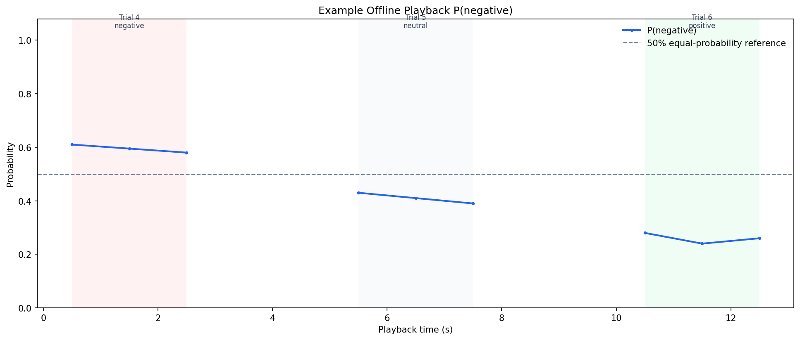

# UDA-DDA EEG Playback System

基于 UDA-DDA（Unsupervised Domain Adaptation with Dynamic Distribution Alignment）模型输出的 SEED 上位机离线回放验证项目。仓库展示“离线模型输出生成 -> 上位机按时间戳同步显示 -> 日志解析绘图”的完整链路。

## 系统定位

1. UDA-DDA 模型训练和无监督域适应在离线阶段完成。
2. 后台脚本生成带时间戳的窗口级预测结果。
3. 上位机读取脑电回放数据和 `predictions_display.csv`。
4. 上位机同步显示波形、频谱、概率、状态和日志。
5. 独立脚本解析日志并绘制消极类别概率曲线。

当前不是实时脑电采集验证，不是在回放期间实时调用模型，也不构成自主闭环刺激控制验证。

## 正式显示规则

正式输出固定使用：

```text
scaler_mode = calibration_feature
scaler_postprocess = clip
DISPLAY_TEMPERATURE = 3.0
DISPLAY_PROB_MODE = causal_rolling_median
DISPLAY_SEGMENT_WINDOW = 10
```

这些参数必须在正式回放前固定，不能利用 trial 4 至 trial 15 的真实标签重新搜索或调节。

每个 trial 单独维护历史。第 `k` 个窗口的显示概率为：

```text
display_prob_negative(k)
  = median(calibrated_prob_negative[max(1, k-9) ... k])
```

因此第 `k` 个输出只使用当前窗口和同一 trial 内的历史窗口，不使用未来窗口，不跨 trial 平滑，也不对缺失窗口插值。

```text
display_prob_non_negative = 1 - display_prob_negative
display_negative_score = 100 * display_prob_negative
display_state = 负性      if display_prob_negative >= 0.5
                非负性    otherwise
```

温度校准只影响 `display_*` 字段。模型原始三分类 softmax 概率 `prob_negative`、`prob_neutral` 和 `prob_positive` 完整保留。

## 标签独立性

`true_label_name` 和 `raw_label` 仅允许用于：

- 回放结束后的描述性统计；
- 日志对照；
- 绘图背景；
- 离线评估。

真实标签不参与概率、状态、scaler 模式、参数选择或默认文件选择。`trial_summary.csv` 也只用于回放后的描述性评估，不会反向修改任何 `display_*` 字段。

## 泄漏诊断模式

`match_training_test` 使用正式回放/测试集统计量拟合 scaler，属于 `leaky_diagnostic`。默认运行不会执行该模式。

仅在需要复现实验诊断时显式启用：

```bash
python inference/generate_upper_demo_predictions_lds.py ... --include-leaky-diagnostic
python inference/test_offline_lds.py ... --include-leaky-diagnostic
```

该模式：

- 输出文件名包含 `diagnostic_only`；
- 会打印数据泄漏警告；
- 无论准确率多高，都不会成为默认 `predictions_display.csv`；
- 不得用于部署或正式显示。

## 仓库结构

```text
.
|-- app/
|   |-- eeg_viewer2.py
|   `-- model_adapters.py
|-- inference/
|   |-- generate_upper_demo_predictions_lds.py
|   |-- test_offline_lds.py
|   |-- SDA_DDA.py
|   |-- backbone.py
|   |-- mmd.py
|   `-- cmmd.py
|-- analysis/
|   `-- plot_upper_demo_negative_history_from_log.py
|-- configs/config.example.yaml
|-- examples/
|-- docs/workflow.md
`-- tests/
```

## 环境安装

建议使用 Python 3.9 或更高版本：

```bash
python -m venv .venv
.venv\Scripts\activate
pip install -r requirements.txt
```

## 生成正式预测结果

SEED 数据、被试级特征和模型权重不随仓库分发。

```bash
python inference/generate_upper_demo_predictions_lds.py ^
  --calib-feature data/seed_features/15_calibration_3trials.mat ^
  --online-feature data/seed_features/15_online_remaining_trials.mat ^
  --model-path models/subject15_calib_supervised_best_model.pth ^
  --meta-csv data/upper_demo/subject15_trial4_15_replay_meta.csv ^
  --output-dir outputs/upper_demo
```

默认输出：

```text
subject15_trial4_15_predictions.csv
subject15_trial4_15_predictions_display.csv
```

二者始终复制自 `calibration_feature + clip` 结果，不根据真实标签或准确率选择。

## 上位机启动

```bash
python app/eeg_viewer2.py
```

加载回放文件后，上位机会在同目录查找 `subject15_trial4_15_predictions_display.csv`。找到后启用 `prediction_mode_enabled=True`：

- 预测结果来源仍是 `predictions_display.csv`；
- 不调用 `model_thread.do_inference`；
- 右上角显示“当前情绪状态输出”信息卡片；
- 原始试次标注只用于离线验证显示；
- 波形和频谱回放逻辑保持不变。

## 日志绘图

```bash
python analysis/plot_upper_demo_negative_history_from_log.py ^
  --log examples/upper_demo_prediction_sync.example.log ^
  --output outputs/negative_history_from_log.png
```



蓝线表示 `P(negative)`；背景表示 SEED 原始试次标注；50% 虚线仅为二类等概率参考线，不是刺激触发阈值；不同 trial 之间不连线；缺失时间点不插值；不显示背景网格线。

## predictions_display.csv

虚构示例见 [examples/predictions_display.example.csv](examples/predictions_display.example.csv)。核心字段包括：

- `time_sec`、`trial_id`、`trial_time_sec`
- `prob_negative`、`prob_neutral`、`prob_positive`
- `prob_non_negative = prob_neutral + prob_positive`
- `prob_negative_calibrated`
- `display_prob_negative`
- `display_prob_non_negative`
- `display_negative_score`
- `display_state`
- `display_prob_mode`
- `display_segment_window`
- `output_role`

## 数据与验证边界

仓库不包含 SEED 原始数据、真实被试文件、模型权重、训练检查点、scaler PKL、完整预测 CSV 或完整系统日志。当前项目仅验证预计算结果接入上位机离线回放，不宣称实时在线模型部署或自主闭环刺激控制。
